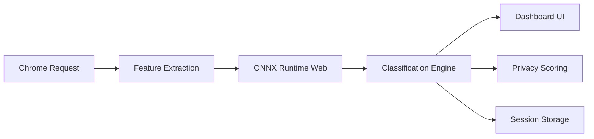

# Specter

A Chrome extension that records and classifies every network request your browser makes — trackers, analytics, ads, fingerprinting scripts, session replay tools, and more — so you can see (and block) exactly what a site is doing in the background.

> Browser-native privacy and tracker analysis powered by fully local ML inference.

Specter is a Chrome MV3 extension that intercepts and classifies network requests in real time — trackers, analytics, fingerprinting scripts, session replay tools, ad infrastructure, and more — entirely on-device using ONNX Runtime + WebAssembly.

No proxy. No cloud inference. No telemetry. No browsing data ever leaves your machine.

---

## Why Specter Exists

Most privacy extensions rely heavily on static blocklists. While effective against known trackers, blocklists struggle with rapidly changing ad infrastructure, newly generated domains, behavioral tracking patterns, and fingerprinting systems that evolve faster than manually maintained signatures.

Specter explores a browser-native alternative:

* Lightweight local inference
* Real-time request analysis
* Explainable classifications
* Privacy-preserving architecture
* Zero external infrastructure
* Low-latency ML inference inside Chrome MV3

The project also serves as an experiment in running performant ML systems entirely inside Manifest V3 service worker constraints.

---

## What it does

- **Classifies** each request using a local XGBoost ML model — no cloud calls, no latency
- **Blocks** trackers and strips tracking parameters from URLs using Chrome's `declarativeNetRequest` API (opt-in, off by default)
- **Shows** a live feed of requests as you browse, color-coded by category and confidence score
- **Scores** each site 0–100 based on tracker density, fingerprinting exposure, and ad activity
- **Stores** every session locally so you can review your browsing history and compare sites over time

---

## Architecture



### Runtime Flow

1. Chrome intercepts outgoing requests using MV3 APIs
2. Specter extracts lightweight request and domain features
3. Features are passed into a local ONNX model
4. Inference executes inside the extension service worker
5. Results are classified, scored, and surfaced in the dashboard
6. Sessions are stored locally for later analysis

---

## Detection Pipeline

Specter ships with a pre-trained XGBoost model located at:

```text
extension/data/model.json
```

The model classifies requests into five categories:

| Class            | Description                                           |
| ---------------- | ----------------------------------------------------- |
| `legitimate`     | First-party assets, fonts, stylesheets, CDN resources |
| `analytics`      | Analytics and telemetry providers                     |
| `ad_network`     | Ad exchanges, DSPs, bidding infrastructure            |
| `behavioral`     | Cross-site trackers and retargeting systems           |
| `fingerprinting` | Browser fingerprinting scripts and infrastructure     |

`session_replay` detection is handled separately using deterministic heuristics.

---

## Feature Engineering

The classifier extracts 27 features per request, including:

* URL entropy
* Path semantics
* Domain structure
* Header patterns
* Resource size
* Query parameter characteristics
* TLD patterns
* Known infrastructure indicators
* Tokenized path signals

Inference executes locally in under 50ms using ONNX Runtime Web.

---

## Model Metrics

| Metric            | Value           |
| ----------------- | --------------- |
| Training Samples  | 25,290 requests |
| Feature Count     | 27              |
| Classes           | 5               |
| Accuracy          | 96.2%           |
| Weighted F1       | 0.967           |
| Inference Runtime | <50ms           |
| Model Format      | ONNX JSON       |
| Model Size        | ~2.4 MB         |

---

## Technical Challenges

### Chrome Manifest V3 Constraints

Manifest V3 replaces persistent background pages with ephemeral service workers, introducing several engineering constraints:

* Cold starts
* Limited execution lifetime
* Resource-sensitive runtime behavior
* Restricted long-running tasks
* Memory limitations

Specter is designed around these constraints while maintaining low-latency request classification.

### Browser-Native Inference

Running inference directly inside a browser extension introduces additional challenges:

* Minimizing model size
* Preventing UI blocking
* Managing inference latency
* Reducing memory overhead
* Supporting WebAssembly execution environments

Specter uses ONNX Runtime Web for efficient local execution without requiring external infrastructure.

---

## Retraining

You can retrain the model locally using your own crawl data.

### 1. Launch Chrome with remote debugging

```bash
npm run chrome
```

### 2. Start a crawl session

```bash
npm run crawl
```

### 3. Export session data

Export sessions from the Specter dashboard and place them into:

```text
tools/exports/
```

### 4. Train the model

```bash
pip install xgboost scikit-learn onnxmltools numpy
python tools/train.py
```

Outputs:

```text
extension/data/model.json
extension/data/model_labels.json
```

The training pipeline:

* Filters to confidence > 0.70
* Applies class balancing
* Generates feature importance rankings
* Prints classification reports
* Exports ONNX-compatible model artifacts

---

## Data & Privacy

All browsing data remains local to the device.

Specter does not:

* collect telemetry
* sync browsing history
* proxy traffic
* upload request data

Optional VirusTotal lookups are disabled by default and require a user-provided API key.

### Local Storage Keys

| Key                     | Contents                   |
| ----------------------- | -------------------------- |
| `session:current`       | Active session metadata    |
| `requests:{session_id}` | Classified request objects |
| `scores:{session_id}`   | Per-site privacy scores    |
| `sessions:history`           | Session summaries                          |
| `settings`                   | User preferences                           |
| `blocking:dynamic_domains`   | Domains promoted to DNR block rules        |
| `blocking:allowlist`         | Per-site domain overrides                  |
| `blocking:stats:{session_id}`| Blocked/stripped counts per session        |

---

## Install

### Chrome Web Store

Install directly from the [Chrome Web Store](https://chromewebstore.google.com/detail/specter/dimockbooampdcmcboibloaflhmpokbl).

---

### Development setup

```bash
npm install
npm run bundle-libs
```

Load the extension:

1. Open `chrome://extensions`
2. Enable **Developer mode**
3. Click **Load unpacked** and select the `extension/` folder
4. Pin the Specter icon to your toolbar

The extension ships as plain JavaScript with no frontend build system.

**Requirements:** Chrome 114+ · Node.js 18+ (build step only)

---

## Usage

### Start a session

Click the Specter icon in your toolbar, then click **▶ NEW SESSION**. Browse normally. Specter records every request in the background.

### Read the live feed

Open the dashboard (`OPEN DASHBOARD` in the popup). The feed shows each request with its category, domain, confidence score, and size. Click any row to see the full URL, headers, response metadata, and which signals drove the classification.

### Enable blocking

Go to **Settings → Blocking** and toggle **Enable blocking**. Blocking is off by default.

With blocking on, Specter:
- Blocks high-confidence trackers using `declarativeNetRequest` dynamic rules
- Strips tracking parameters (`fbclid`, `gclid`, `utm_*`, etc.) from URLs before requests are sent
- Shows a red `BLOCKED` or amber `STRIPPED` badge on affected feed rows

If a site breaks, click the blocked request in the feed and choose **Allow on this site** or **Allow everywhere** to add it to the allow-list.

### Review session history

Click the clock icon in the dashboard nav to open **Session History**. Click any session to see a per-site breakdown with tracker counts and privacy scores. Export a full JSON dump or copy a plain-text report.

---

## Configuration

All settings are in **Dashboard → Settings**.

| Setting | Default | Description |
|---------|---------|-------------|
| Autoscroll | On | Feed scrolls to new rows automatically |
| Min confidence | 0% | Hides requests classified below this confidence |
| Data retention | Forever | Auto-delete sessions older than N days |
| VirusTotal API key | — | Enables domain reputation lookups in the detail panel |
| Use ML classifier | On | Switch to rule-based classifier if off |
| Enable blocking | **Off** | Master switch for the blocking engine |
| Blocking mode | Smart | Smart (ML-driven) · Strict (all third-party) · Param strip only |
| Block threshold | 85% | Confidence required to block in Smart mode |
| Block session replay | On | Always block Hotjar, FullStory, LogRocket, etc. |
| Block fingerprinting | On | Always block canvas/font/WebGL fingerprint scripts |
| Block behavioral | On | Block behavioral trackers above threshold |
| Block ad networks | On | Block ad exchanges and bidding infrastructure above threshold |
| Block analytics | **Off** | Block analytics (may break some sites) |

---

## Project structure

```text
specter/
├── extension/               Chrome extension (load this folder)
│   ├── dashboard.html/js/css
│   ├── popup.html/js/css
│   ├── blocking-ui.js       Blocking settings UI + feed badges
│   ├── blocking.js          Adaptive blocking engine (DNR rules)
│   ├── service_worker.js
│   ├── shared.css
│   └── data/
│       ├── blocking_rules.json
│       ├── model.json
│       ├── model_labels.json
│       └── sites.txt
│
├── tools/
│   ├── crawl.js
│   ├── launch-chrome.js
│   ├── train.py
│   └── exports/
│
├── scripts/
│   └── bundle-libs.js
│
└── LICENSE
```

---

## Roadmap

* Incremental model updates
* Expanded tracker taxonomy
* Improved phishing detection
* Better explainability tooling
* Lightweight model quantization
* Request clustering
* Advanced session analytics
* Performance benchmarking suite

---

## Contributing

1. Load the extension unpacked as described in [Development setup](#development-setup)
2. Edit files in `extension/` — changes take effect after clicking **⟳** in `chrome://extensions`
3. The service worker reloads automatically when you restart a session from the popup
4. No build step for the extension itself — only `npm run bundle-libs` is needed once

> [!NOTE]
> The extension uses Manifest V3. `webRequestBlocking` is not available to regular (non-enterprise) MV3 extensions. All blocking is done via `declarativeNetRequest`. Do not add `webRequest` blocking listeners — they will be silently ignored.

---

## License

MIT — Divij Agarwal. See [LICENSE](LICENSE).
