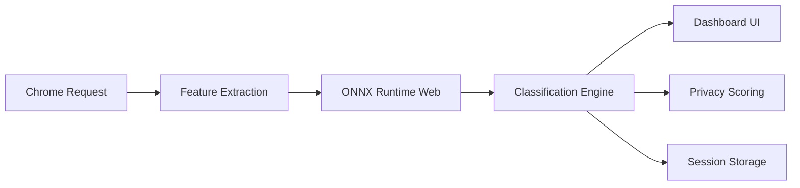

# Specter

[](./LICENSE)
[](https://github.com/divij404/specter/releases)
[](https://chromewebstore.google.com/detail/specter/dimockbooampdcmcboibloaflhmpokbl)
[](https://chromewebstore.google.com/detail/specter/dimockbooampdcmcboibloaflhmpokbl)

> Browser-native privacy and tracker analysis powered by fully local ML inference.

Specter is a Chrome MV3 extension that intercepts and classifies network requests in real time — trackers, analytics, fingerprinting scripts, session replay tools, ad infrastructure, and more — entirely on-device using ONNX Runtime + WebAssembly.

No proxy. No cloud inference. No telemetry. No browsing data ever leaves your machine.

---

## Why Specter Exists

Most privacy extensions rely heavily on static blocklists. While effective against known trackers, blocklists struggle with rapidly changing ad infrastructure, newly generated domains, behavioral tracking patterns, and fingerprinting systems that evolve faster than manually maintained signatures.

Specter explores a browser-native alternative:

* Lightweight local inference
* Real-time request analysis
* Explainable classifications
* Privacy-preserving architecture
* Zero external infrastructure
* Low-latency ML inference inside Chrome MV3

The project also serves as an experiment in running performant ML systems entirely inside Manifest V3 service worker constraints.

---

## Features

### Detection & Classification

| Feature                      | Description                                                                                                                                |
| ---------------------------- | ------------------------------------------------------------------------------------------------------------------------------------------ |
| **ML Classifier**            | XGBoost model (300 rounds, 5 classes) trained on real browsing telemetry. Confidence scores per request with weighted fallback heuristics. |
| **Fingerprinting Detection** | Detects canvas, font, WebGL, audio, and related fingerprinting behaviors.                                                                  |
| **Session Replay Detection** | Identifies tools such as Hotjar and FullStory using rule-based analysis.                                                                   |
| **Explainability Panel**     | Displays feature importances and top classification signals for each request.                                                              |
| **Privacy Score**            | Real-time per-site score (0–100) based on tracker density, fingerprinting exposure, replay scripts, and ad activity.                       |

### Visualization & Analysis

| Feature               | Description                                                                                  |
| --------------------- | -------------------------------------------------------------------------------------------- |
| **Live Feed**         | Real-time stream of classified requests with filtering, grouping, and pause/resume controls. |
| **Timeline View**     | D3.js-powered request timeline color-coded by category.                                      |
| **Site Summary**      | Per-site breakdown with category distribution and request composition.                       |
| **Request Inspector** | Full URL breakdown, headers, metadata, response information, and classification details.     |

### Session Management

| Feature             | Description                                                                   |
| ------------------- | ----------------------------------------------------------------------------- |
| **Session History** | Stores browsing sessions locally with sortable summaries and site breakdowns. |
| **Export Tools**    | Export complete session JSON or copy plain-text reports.                      |
| **Local Storage**   | All session data stored in `chrome.storage.local`.                            |

### Training & Developer Tooling

| Feature                   | Description                                                             |
| ------------------------- | ----------------------------------------------------------------------- |
| **Training Crawl Engine** | Built-in Puppeteer crawl pipeline for generating labeled browsing data. |
| **Model Retraining**      | Retrain locally using exported sessions and custom crawl data.          |
| **Rule-Based Fallbacks**  | Weighted heuristics used when ML confidence is insufficient.            |

---

## Architecture



### Runtime Flow

1. Chrome intercepts outgoing requests using MV3 APIs
2. Specter extracts lightweight request and domain features
3. Features are passed into a local ONNX model
4. Inference executes inside the extension service worker
5. Results are classified, scored, and surfaced in the dashboard
6. Sessions are stored locally for later analysis

---

## Detection Pipeline

Specter ships with a pre-trained XGBoost model located at:

```text
extension/data/model.json
```

The model classifies requests into five categories:

| Class            | Description                                           |
| ---------------- | ----------------------------------------------------- |
| `legitimate`     | First-party assets, fonts, stylesheets, CDN resources |
| `analytics`      | Analytics and telemetry providers                     |
| `ad_network`     | Ad exchanges, DSPs, bidding infrastructure            |
| `behavioral`     | Cross-site trackers and retargeting systems           |
| `fingerprinting` | Browser fingerprinting scripts and infrastructure     |

`session_replay` detection is handled separately using deterministic heuristics.

---

## Feature Engineering

The classifier extracts 27 features per request, including:

* URL entropy
* Path semantics
* Domain structure
* Header patterns
* Resource size
* Query parameter characteristics
* TLD patterns
* Known infrastructure indicators
* Tokenized path signals

Inference executes locally in under 50ms using ONNX Runtime Web.

---

## Model Metrics

| Metric            | Value           |
| ----------------- | --------------- |
| Training Samples  | 25,290 requests |
| Feature Count     | 27              |
| Classes           | 5               |
| Accuracy          | 96.2%           |
| Weighted F1       | 0.967           |
| Inference Runtime | <50ms           |
| Model Format      | ONNX JSON       |
| Model Size        | ~2.4 MB         |

---

## Technical Challenges

### Chrome Manifest V3 Constraints

Manifest V3 replaces persistent background pages with ephemeral service workers, introducing several engineering constraints:

* Cold starts
* Limited execution lifetime
* Resource-sensitive runtime behavior
* Restricted long-running tasks
* Memory limitations

Specter is designed around these constraints while maintaining low-latency request classification.

### Browser-Native Inference

Running inference directly inside a browser extension introduces additional challenges:

* Minimizing model size
* Preventing UI blocking
* Managing inference latency
* Reducing memory overhead
* Supporting WebAssembly execution environments

Specter uses ONNX Runtime Web for efficient local execution without requiring external infrastructure.

---

## Retraining

You can retrain the model locally using your own crawl data.

### 1. Launch Chrome with remote debugging

```bash
npm run chrome
```

### 2. Start a crawl session

```bash
npm run crawl
```

### 3. Export session data

Export sessions from the Specter dashboard and place them into:

```text
tools/exports/
```

### 4. Train the model

```bash
pip install xgboost scikit-learn onnxmltools numpy
python tools/train.py
```

Outputs:

```text
extension/data/model.json
extension/data/model_labels.json
```

The training pipeline:

* Filters to confidence > 0.70
* Applies class balancing
* Generates feature importance rankings
* Prints classification reports
* Exports ONNX-compatible model artifacts

---

## Data & Privacy

All browsing data remains local to the device.

Specter does not:

* collect telemetry
* sync browsing history
* proxy traffic
* upload request data

Optional VirusTotal lookups are disabled by default and require a user-provided API key.

### Local Storage Keys

| Key                     | Contents                   |
| ----------------------- | -------------------------- |
| `session:current`       | Active session metadata    |
| `requests:{session_id}` | Classified request objects |
| `scores:{session_id}`   | Per-site privacy scores    |
| `sessions:history`      | Session summaries          |
| `settings`              | User preferences           |

---

## Install

### Chrome Web Store

Install directly from the Chrome Web Store:

https://chromewebstore.google.com/detail/specter/dimockbooampdcmcboibloaflhmpokbl

---

### Development Setup

```bash
npm install
npm run bundle-libs
```

Load the extension:

1. Open `chrome://extensions`
2. Enable Developer Mode
3. Click **Load unpacked**
4. Select the `extension/` directory

The extension ships as plain JavaScript with no frontend build system.

---

## Requirements

* Chrome 114+
* Node.js 18+ (development only)

---

## Project Structure

```text
specter/
├── extension/
│   ├── dashboard.html/js/css
│   ├── popup.html/js/css
│   ├── service_worker.js
│   └── data/
│       ├── blocklist.json
│       ├── model.json
│       ├── model_labels.json
│       └── sites.txt
│
├── tools/
│   ├── crawl.js
│   ├── launch-chrome.js
│   ├── train.py
│   └── exports/
│
├── scripts/
│   └── bundle-libs.js
│
└── LICENSE
```

---

## Roadmap

* Incremental model updates
* Expanded tracker taxonomy
* Improved phishing detection
* Better explainability tooling
* Lightweight model quantization
* Request clustering
* Advanced session analytics
* Performance benchmarking suite

---

## License

MIT — Divij Agarwal
